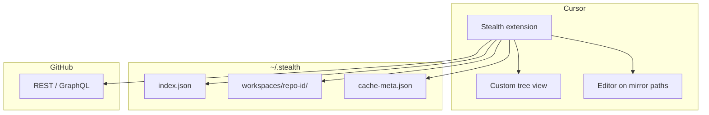

# Stealth — Plan

**One-liner:** Open any GitHub repo in Cursor without a full clone; only files you open (and a small index) use disk.

**Target user (v1):** Solo dev / student on a small SSD who wants to browse, edit, and push without 5–20 GB per repo.

**Not v1:** Enterprise SSO, monorepo build farms, GitLab/Bitbucket, “true offline” for whole repos, replacing Remote SSH.

---

## How it should feel

1. Command: **Stealth: Open GitHub Repository…**
2. Pick repo + branch (default: default branch).
3. Cursor opens a workspace folder that looks normal.
4. Sidebar shows the **full file tree** (names only — not downloaded yet).
5. Click a file → it appears in the editor within ~1s (downloaded once).
6. Save → change is committed/pushed (or staged — see v0.2).
7. Status bar: `Stealth: repo | cache | API quota` and **Evict** / **Pin workspace** (implemented).

---

## Core idea (technical)

Two layers:

| Layer | Job |
|--------|-----|
| **Index** | Repo tree + SHAs from GitHub (metadata, tiny on disk) |
| **Cache** | File *contents* only for paths you opened or pinned (LRU cap) |

No `.git` with full object store on disk for MVP. Git history stays on GitHub; local state is **workspace + index + cache**.

```text
Cursor  →  Stealth extension  →  GitHub API
                ↓
         ~/.stealth/
           indexes/<repo>.json    (tree)
           workspaces/<id>/       (mirrored files you touched)
           cache/                 (optional blob dedupe later)
```

**Why mirror files you open (not pure virtual FS in v1):**  
Language servers (TypeScript, Python, etc.) expect real paths. Easiest MVP: when you open `src/App.tsx`, write bytes to  
`~/.stealth/workspaces/<repo-id>/src/App.tsx` so Cursor’s LSP “just works.”

**Later:** virtual `FileSystemProvider` + remote LSP if mirror isn’t enough.

---

## MVP scope

### In (v0.1 — “read mostly”)

- [x] GitHub OAuth (read repo contents)
- [x] Open public or user’s private repos
- [x] Fetch recursive tree for a branch → store index
- [x] Custom file tree in sidebar (from index, not from disk)
- [x] Open file → download blob → write to workspace mirror → open editor
- [x] LRU eviction of **file contents** (keep index + stubs)
- [x] Configurable cache cap (default 500 MB)
- [x] Status bar: cache size + repo

### In (v0.2 — “edit and save”)

- [x] Save file → commit on a branch via GitHub API or minimal git client
- [x] Delete file on GitHub
- [x] Create / rename file (single-file ops)
- [x] Simple conflict message if remote changed same file

### Out (post-MVP)

- Full local `git` (blame, log, branches UI) without network
- `node_modules` / install / run terminal in repo (needs dev environment story)
- GitLab, self-hosted, Google Drive backend
- Multiplayer / live share
- AI index of whole repo without download (separate product surface)

---

## User flows

### Flow A — Open repo

```
User → "Open GitHub Repo"
     → OAuth if needed
     → GET /repos/{owner}/{repo}/git/trees/{branch}?recursive=1
     → Save index JSON (~few MB even for large repos)
     → Open workspace folder (mostly empty except .stealth/config.json)
     → Tree view populated from index
```

### Flow B — Open file

```
User clicks path in tree
     → If mirror exists and SHA matches index → open mirror
     → Else GET contents API (or blob API) → write mirror → open
     → Mark path as MRU in cache metadata
```

### Flow C — Save file

```
User saves in editor
     → Write mirror
     → PUT contents API (needs SHA of current blob) OR git commit via ephemeral clone
     → Update index entry SHA for that path
```

### Flow D — Evict / pin

```
Pin project → never evict mirrored files for this repo id
Evict → delete mirrored files until under cap (LRU), keep index
```

---

## Architecture (v1)



### Extension modules

| Module | Responsibility |
|--------|----------------|
| `auth` | GitHub OAuth device flow or PAT storage in SecretStorage |
| `index` | Fetch/normalize tree; lookup path → blob SHA |
| `mirror` | Read/write files under workspace; ensure parent dirs |
| `cache` | LRU, cap, pin, eviction |
| `tree` | VS Code TreeDataProvider from index |
| `commands` | Open repo, evict, pin, refresh index |
| `github` | API client, rate-limit tracking + low-quota guard |

### Repo layout (monorepo)

```text
stealth/
  PLAN.md
  packages/
    extension/          # VS Code / Cursor extension (TypeScript)
    shared/             # types: Index, FileEntry, Config
  .github/workflows/    # lint + vsce package (later)
```

---

## GitHub API choices

| Need | API | Notes |
|------|-----|--------|
| Full tree | `GET .../git/trees/{ref}?recursive=1` | One call; 100k entry limit — handle truncation later |
| File read | `GET .../contents/{path}?ref=` or blob API | Contents API base64; fine for text |
| File write | `PUT .../contents/{path}` | Needs `sha` of existing file |
| Rate limits | 5000 req/hr authenticated | Cache tree; batch carefully |

**Truncation (large repos):** shallow index + lazy folder expand; optional deep index.

---

## Disk budget (what lives where)

| Data | Typical size | Evict? |
|------|----------------|--------|
| Index (paths + SHAs) | 1–50 MB | No (refresh from GitHub) |
| Mirrored file contents | User cap (500 MB default) | Yes, LRU |
| Extension state | < 1 MB | — |

**Compare to full clone:** same repo might be 2 GB clone + 300 MB `node_modules` — you might use 30 MB until you open many files.

---

## Phases & milestones

### Phase 0 — Setup (1–2 days)

- Init monorepo, TypeScript, `@types/vscode`
- “Hello World” extension loads in Cursor
- Define shared types: `RepoRef`, `FileIndex`, `CacheEntry`

### Phase 1 — Read-only open (1 week)

- GitHub OAuth + store token
- Command: open repo → build index → open workspace
- Tree view from index; clicking file downloads + opens
- `.stealth/config.json` in workspace: `owner`, `repo`, `branch`, `treeSha`

**Done when:** You can browse a public repo and read files without `git clone`.

### Phase 2 — Cache & polish (3–5 days)

- [x] LRU eviction + cap
- [x] Status bar + “Refresh index” + API quota
- [x] Error UX: rate limit warn, private repo denied, binary file warning
- [x] Lazy / shallow index for large trees (truncation)

**Done when:** Cache stays under cap over a week of normal use.

### Phase 3 — Save back (1 week)

- Save → GitHub PUT with blob SHA from index
- “File changed on GitHub” conflict detection
- Optional: create branch for edits (`stealth/edit-...`)

**Done when:** You can fix a typo in a README and see it on GitHub.

### Phase 4 — Ship alpha (ongoing)

- [x] README, ship checklist ([SHIP.md](./SHIP.md)), demo script ([DEMO.md](./DEMO.md))
- [x] Package `.vsix` (`npm run package`)
- [x] Open VSX workflow ([PUBLISHING.md](./PUBLISHING.md))
- [ ] Record demo GIF and publish to Open VSX (your token + namespace)
- [ ] Dogfood on 3 repos: tiny, medium, large ([SHIP.md](./SHIP.md))

---

## Risks & mitigations

| Risk | Mitigation |
|------|------------|
| LSP needs files on disk | Mirror-on-touch (v1); Remote LSP later |
| GitHub API rate limits | Cache tree; debounce refresh; show remaining quota |
| Large tree truncated | Warn; lazy-load folders in v0.2 |
| Binary / large files | Size check before download; refuse > N MB in v1 |
| Save conflicts | Compare SHA before PUT; offer overwrite / pull |
| “Without cloning” purists | Marketing = no full clone; technically minimal git OK in v2 for hard ops |
| Cursor vs VS Code | Build as standard VS Code extension; test both |

---

## Success metrics (alpha)

- Time to first file open: **< 15 s** (cold, includes OAuth once)
- Disk after opening 10 files: **< 5 MB** for a 1 GB repo
- No full `git clone` directory for indexed workflow
- Save works for single-file text edit on default branch

---

## Open decisions (pick before coding)

1. **Auth:** ~~OAuth app vs PAT~~ → **OAuth** via `vscode.authentication` + GitHub provider (implemented).
2. **Writes:** GitHub Contents API only (simple) vs hidden `git` for commits (flexible)?
3. **Workspace UI:** Custom tree only vs hybrid with empty folders on disk?
4. **Name:** Stealth vs something descriptive for marketplace?

**Recommendation for speed:** PAT or OAuth + Contents API + custom tree + mirror-on-touch.

---

## Next step after this plan

Implement **Phase 0 + Phase 1** in `packages/extension`:

1. Scaffold extension with `yo code` or manual `package.json` + `esbuild`
2. `Open GitHub Repository` command
3. Tree + open file path

No daemon required until grep/search across repo without API becomes painful.
