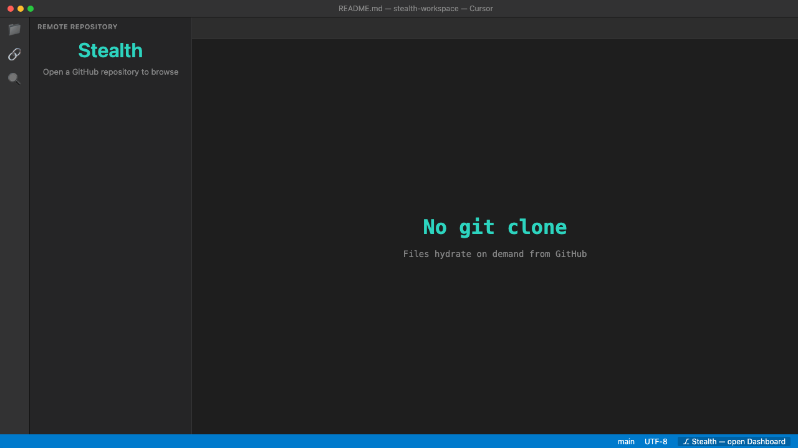

# Stealth

Open a GitHub repo in VS Code / Cursor **without `git clone`**. Stealth keeps a shallow index on disk; only files you open (hydrate) count toward a **cache cap** you control.



## Install

**Open VSX / Cursor:** Extensions → search **Stealth** → [kingpranav21/stealth](https://open-vsx.org/extension/kingpranav21/stealth)

**From source:**

```bash
git clone https://github.com/pranavahuja/stealth.git
cd stealth
npm install
npm run package
```

**Cmd+Shift+P** → **Extensions: Install from VSIX…** → `packages/extension/stealth-*.vsix` → reload.

## Quick start

1. **Stealth: Sign in to GitHub**
2. **Stealth: Open GitHub Repository…** → `owner/repo`
3. **Remote Repository** (sidebar) — browse and open files
4. Edit → **Cmd+S** → pushed to GitHub
5. Status bar (bottom-right) → **Stealth Dashboard**

## Features

- Shallow / lazy index, hydrate files on demand
- Save to GitHub via Contents API (no local `.git`)
- **Stub Guard** — warns when editors see stub placeholders instead of real code
- **Disk Governor** — optional cap on all `~/.stealth` workspaces
- Dashboard, find file, branch switch, compare/pull, PR link

## Settings

| Setting | Default | Description |
|---------|---------|-------------|
| `stealth.cacheMaxMb` | 500 | Max hydrated bytes per workspace |
| `stealth.globalCacheMaxMb` | 0 | Mac-wide cap under `~/.stealth` (0 = off) |
| `stealth.indexMode` | shallow | `shallow` or `full` index on open |
| `stealth.stubGuard` | true | Warn on stub content in editor |
| `stealth.checkRemoteBeforeSave` | true | Warn if remote changed before save |

Data lives under `~/.stealth/`.

## Development

```bash
npm install
npm run build
```

**F5** → **Run Stealth Extension** (Extension Development Host).

Regenerate README demo GIF: `npm run demo-gif`

## License

MIT — see [LICENSE](./LICENSE).
